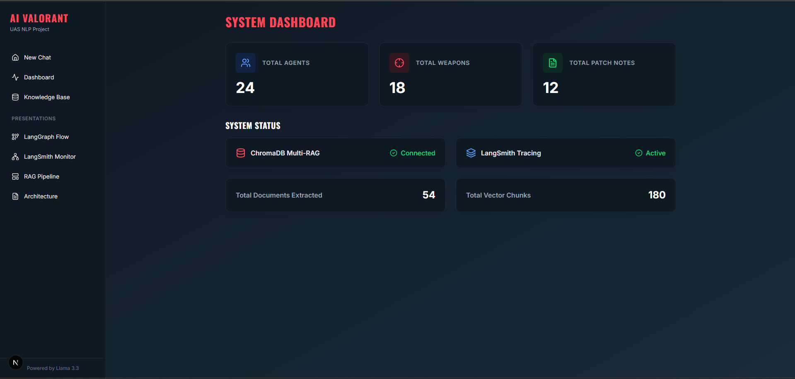
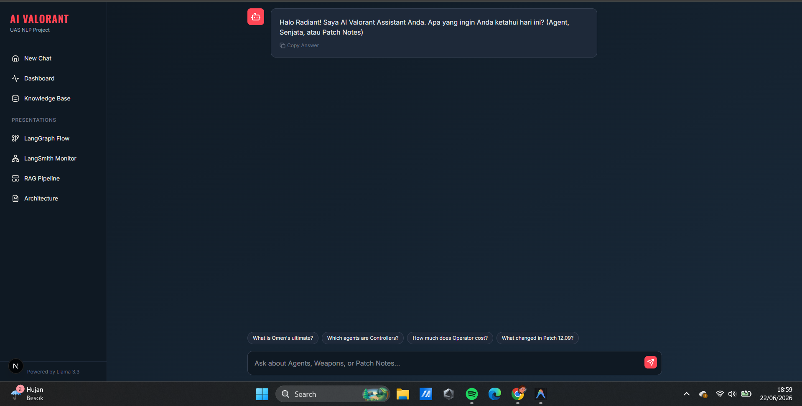
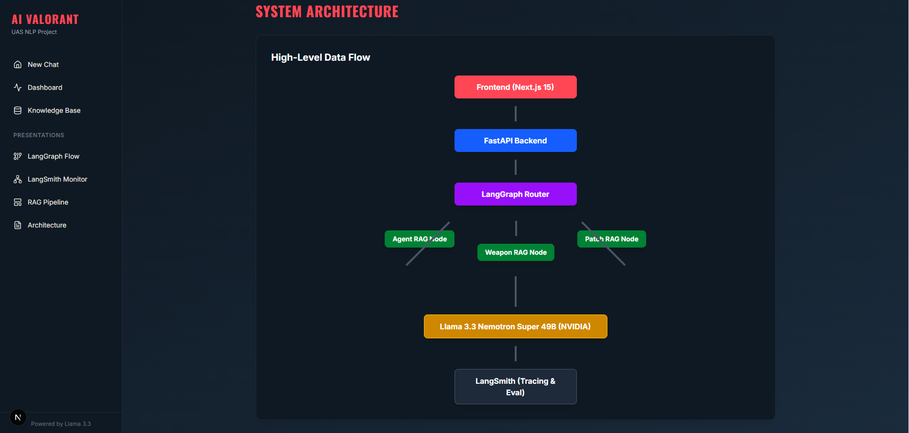
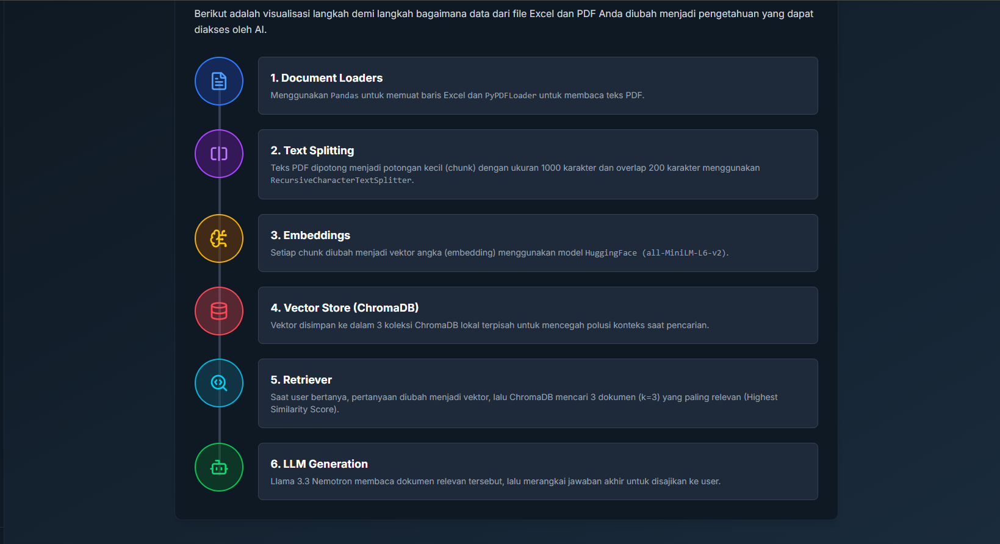
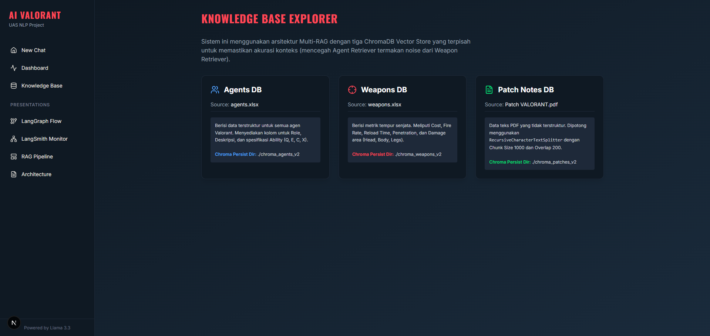
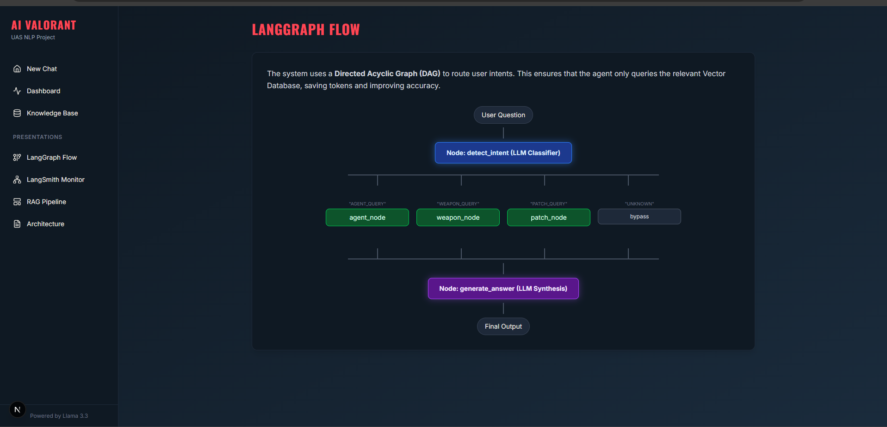
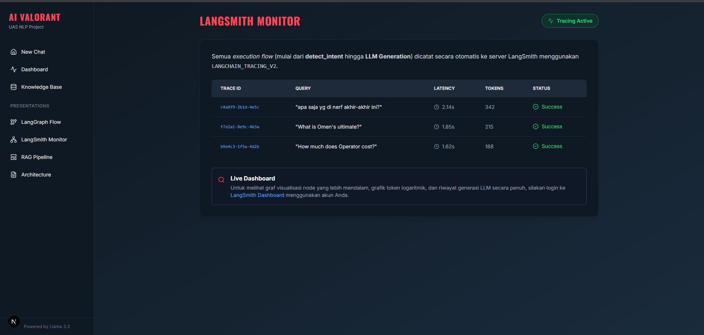

<div align="center">
  
  <h1>🎮 AI Valorant Assistant</h1>
  <p><strong>UAS Natural Language Processing (NLP) Project</strong></p>
  <p>
    
    
    
    
  </p>
</div>

---

## 📝 Deskripsi Proyek
**AI Valorant Assistant** adalah sebuah chatbot cerdas berbasis AI yang dirancang layaknya asisten atau *coach* bagi pemain Valorant. Sistem ini dapat menjawab pertanyaan spesifik seputar detail agen, spesifikasi senjata, dan *patch notes* terbaru dengan keakuratan tinggi dan **bebas halusinasi**.

Proyek ini tidak menggunakan arsitektur RAG konvensional, melainkan mengusung inovasi **Multi-RAG dengan Intent-based Routing** yang dibalut dalam ekosistem aplikasi *Full-Stack*.

---

## ✨ Fitur Utama (Keunikan Proyek)
1. **Agentic Workflow (LangGraph)**: Memiliki kecerdasan untuk mengklasifikasi niat pengguna (*detect_intent*) sebelum melakukan pencarian data.
2. **Multi-RAG Architecture**: Pemisahan laci memori menjadi 3 *Vector Store* independen (`Agent`, `Weapon`, `Patch`) untuk mencegah polusi konteks.
3. **Source Citation**: Menyertakan metadata dan referensi asal data (*Retrieved Documents*) di setiap jawaban.
4. **Full-Stack Premium UI**: Antarmuka web modern dengan Next.js 15 dan Tailwind CSS bernuansa *Valorant Dark Mode*.
5. **Observability**: Terintegrasi penuh dengan LangSmith untuk pemantauan latensi dan konsumsi token.

---

## 📸 Screenshots

| System Dashboard | New Chat (AI Interface) |
| :---: | :---: |
|  |  |

| Architecture | RAG Pipeline |
| :---: | :---: |
|  |  |

| Knowledge Base | LangGraph Flow |
| :---: | :---: |
|  |  |

| LangSmith Monitor | |
| :---: | :---: |
|  | |

---

## 📚 Library NLP Wajib yang Digunakan
Sesuai dengan kriteria tugas, proyek ini mengimplementasikan:
- **[LangChain]**: Bertugas untuk proses *Data Ingestion* (menggunakan `PyPDFLoader`, `RecursiveCharacterTextSplitter`) dan *Retrieval* dari *HuggingFaceEmbeddings*.
- **[LangGraph]**: Bertugas mengatur logika *routing* menggunakan `StateGraph` dan *Conditional Edges* untuk arsitektur Multi-RAG.
- **[LangSmith]**: Bertugas untuk melacak dan mengevaluasi setiap *trace*, latensi, dan token (*Observability*).

---

## 🚀 Cara Menjalankan Program (Localhost)

1️⃣ Menjalankan Backend (FastAPI)
Buka Terminal pertama, lalu jalankan perintah berikut:
```bash
# 1. Masuk ke direktori utama
cd D:\VLR

# 2. Aktifkan Virtual Environment
.\venv\Scripts\activate

# 3. Jalankan server FastAPI
python -m backend.main

2️⃣ Menjalankan Frontend (Next.js)
Buka Terminal kedua (biarkan terminal Backend tetap menyala), lalu jalankan:
```bash
# 1. Masuk ke folder frontend
cd D:\VLR\frontend

# 2. Instal dependensi (jika belum)
npm install

# 3. Jalankan server Next.js
npm run dev
```

### 3️⃣ Memulai Aplikasi
Buka Web Browser Anda dan kunjungi: **`http://localhost:3000`**
